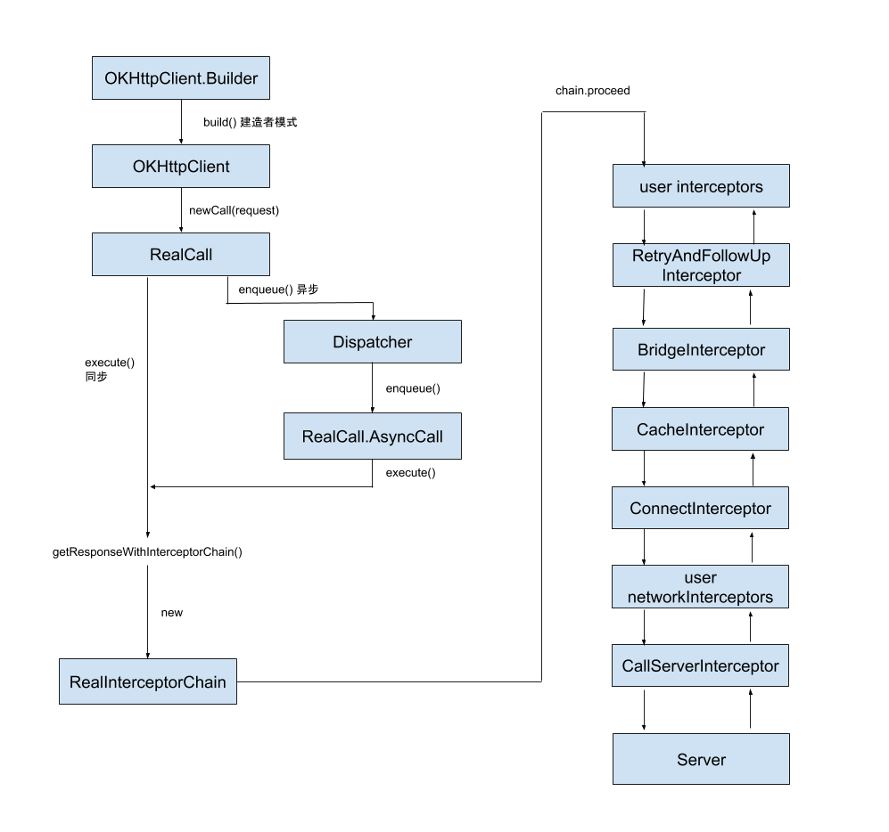

# OkHttp 源码分析（一）：请求流程

这篇文章主要梳理一下 OkHttp 的请求流程，对 OkHttp 的实现原理有个整体的把握，再深入细节的实现会更加容易。

建议将 OkHttp 的源码下载下来，使用 IDEA 编辑器可以直接打开阅读。我这边也将最新版的源码下载下来，进行了注释说明，有需要的可以直接从 [Android open framework analysis](https://github.com/zywudev/android-open-framework-analysis) 下载查看。

## 基本使用

我们先看一下 OkHttp 的基本使用。

```java
// 1、创建 Request
Request request = new Request.Builder()
    .get()
    .url("xxx")
    .build(); 

// 2、创建 OKHttpClient
OkHttpClient client = new OkHttpClient();

// 3、创建 Call
Call call = client.newCall(request);

try {
    // 4、同步请求
    Response response = call.execute();
} catch (IOException e) {
    e.printStackTrace();
}

// 5、异步请求
call.enqueue(new Callback() {
    @Override
    public void onFailure(Call call, IOException e) {

    }

    @Override
    public void onResponse(Call call, Response response) throws IOException {

    }
});
```

上面的代码中，首先构建一个请求 Request 和一个客户端 OkHttpClient，然后 OkHttpClient 对象根据 request 调用 `newCall` 方法创建 Call 对象，再调用 `execute` 或者 `enqueue` 方法进行同步或者异步请求。

接下来我们看一看关键类和关键流程的具体实现。

## Request

Request 类封装了一次请求需要传递给服务端的参数：请求 method 如 GET/POST 等、一些 header、RequestBody 等等。

Request 类未对外提供 public 的构造函数，所以构建一个 Request 实例需要使用构造者模式构建。

```java
Request(Builder builder) {
    this.url = builder.url;
    this.method = builder.method;
    this.headers = builder.headers.build();
    this.body = builder.body;
    this.tags = Util.immutableMap(builder.tags);
}
```

## OkHttpClient

OkHttpClient 支持两种构造方式。

一种是默认的构造方式：

```java
OkHttpClient client = new OkHttpClient();
```

看一下构造函数：

```java
public OkHttpClient() {
     this(new Builder());
 }
```

这里 OkHttpClient 内部默认配置了一些参数。

```java
OkHttpClient(Builder builder) {...}
```

另一种是通过 Builder 配置参数，最后通过 `build` 方法构建一个 OkHttpClient 对象。

```java
OkHttpClient client = new OkHttpClient.Builder().build();

public OkHttpClient build() {
    return new OkHttpClient(this); // 这里的 this 是 Builder 实例
}
```

我们看一下 OkHttpClient 可配置哪些参数：

```java
final Dispatcher dispatcher;    // 调度器
final @Nullable
Proxy proxy; // 代理
final List<Protocol> protocols;  // 协议
final List<ConnectionSpec> connectionSpecs;  // 传输层版本和连接协议
final List<Interceptor> interceptors;  // 拦截器
final List<Interceptor> networkInterceptors;  // 网络拦截器
final EventListener.Factory eventListenerFactory;
final ProxySelector proxySelector; // 代理选择器
final CookieJar cookieJar;  // cookie
final @Nullable
Cache cache;  // 缓存
final @Nullable
InternalCache internalCache;  // 内部缓存
final SocketFactory socketFactory;  // socket 工厂
final SSLSocketFactory sslSocketFactory;  // 安全套接层 socket 工厂，用于 https
final CertificateChainCleaner certificateChainCleaner; // 验证确认响应证书 适用 HTTPS 请求连接的主机名
final HostnameVerifier hostnameVerifier; // 主机名字验证
final CertificatePinner certificatePinner; // 证书链
final Authenticator proxyAuthenticator; // 代理身份验证
final Authenticator authenticator; // 本地身份验证
final ConnectionPool connectionPool;  // 连接池
final Dns dns;  // 域名
final boolean followSslRedirects;  // 安全套接层重定向
final boolean followRedirects;  // 本地重定向
final boolean retryOnConnectionFailure;  // 重试连接失败
final int callTimeout;
final int connectTimeout;
final int readTimeout;
final int writeTimeout;
final int pingInterval;
```

## Call

Call 是一个接口，是请求的抽象描述，具体实现类是 RealCall，通过Call.Factory 创建。

```java
public interface Call extends Cloneable {
  // 返回当前请求
  Request request();

  // 同步请求方法
  Response execute() throws IOException;

  // 异步请求方法
  void enqueue(Callback responseCallback);

  // 取消请求
  void cancel();

  // 请求是否在执行（当execute()或者enqueue(Callback responseCallback)执行后该方法返回true）
  boolean isExecuted();

  // 请求是否被取消
  boolean isCanceled();
  
  Timeout timeout();

  // 创建一个新的一模一样的请求
  Call clone();

  interface Factory {
    Call newCall(Request request);
  }
}
```

OkHttpClient 实现了 Call.Factory，负责根据 Request 创建新的 Call：

```
Call call = client.newCall(request);
```

看一下 `newCall` 方法。

```java
@Override
public Call newCall(Request request) {
    return RealCall.newRealCall(this, request, false /* for web socket */);
}
```

这里我们发现实际上调用了 RealCall 的静态方法 `newRealCall`， 不难猜测 这个方法就是创建 Call 对象。

```java
static RealCall newRealCall(OkHttpClient client, Request originalRequest, boolean forWebSocket) {
    // Safely publish the Call instance to the EventListener.
    RealCall call = new RealCall(client, originalRequest, forWebSocket);
    call.eventListener = client.eventListenerFactory().create(call);
    return call;
}
```

## 同步请求

从上面的分析我们知道，同步请求调用的实际是 RealCall 的 `execute` 方法。

```java
@Override public Response execute() throws IOException {
    synchronized (this) {
      // 每个 call 只能执行一次
      if (executed) throw new IllegalStateException("Already Executed");
      executed = true;
    }
    captureCallStackTrace();
    timeout.enter();
    eventListener.callStart(this);
    try {
      // 请求开始, 将自己加入到runningSyncCalls队列中
      client.dispatcher().executed(this);
      // 通过一系列拦截器请求处理和响应处理得到最终的返回结果
      Response result = getResponseWithInterceptorChain();
      if (result == null) throw new IOException("Canceled");
      return result;
    } catch (IOException e) {
      e = timeoutExit(e);
      eventListener.callFailed(this, e);
      throw e;
    } finally {
      // 请求完成, 将其从runningSyncCalls队列中移除
      client.dispatcher().finished(this);
    }
  }
```

这里主要做了这几件事：

- 检测这个 call 是否已经执行了，保证每个 call 只能执行一次。
- 通知 dispatcher 已经进入执行状态，将 call 加入到 runningSyncCalls 队列中。
- 调用 `getResponseWithInterceptorChain()` 函数获取 HTTP 返回结果。
- 最后还要通知 `dispatcher` 自己已经执行完毕，将 call 从 runningSyncCalls 队列中移除。

这里涉及到了 Dispatcher 这个类，我们在异步请求这一节中再介绍。

真正发出网络请求以及解析返回结果的是在 `getResponseWithInterceptorChain` 方法中进行的。

```java
Response getResponseWithInterceptorChain() throws IOException {
    List<Interceptor> interceptors = new ArrayList<>();
    interceptors.addAll(client.interceptors());
    interceptors.add(retryAndFollowUpInterceptor);
    interceptors.add(new BridgeInterceptor(client.cookieJar()));
    interceptors.add(new CacheInterceptor(client.internalCache()));
    interceptors.add(new ConnectInterceptor(client));
    if (!forWebSocket) {
      interceptors.addAll(client.networkInterceptors());
    }

    interceptors.add(new CallServerInterceptor(forWebSocket));

    Interceptor.Chain chain = new RealInterceptorChain(interceptors, null, null, null, 0,
        originalRequest, this, eventListener, client.connectTimeoutMillis(),
        client.readTimeoutMillis(), client.writeTimeoutMillis());
    
    return chain.proceed(originalRequest);
```

`getResponseWithInterceptorChain` 方法的代码量并不多，但是却完成了所有的请求处理过程。

这里先是创建了一个 Interceptor 的集合，然后将各类 interceptor 全部加入到集合中，包含以下 interceptor：

- interceptors：配置 OkHttpClient 时设置的 inteceptors
- RetryAndFollowUpInterceptor：负责失败重试以及重定向
- BridgeInterceptor：负责把用户构造的请求转换为发送到服务器的请求、把服务器返回的响应转换为用户友好的响应
- CacheInterceptor：负责读取缓存直接返回、更新缓存
- ConnectInterceptor：负责和服务器建立连接
- networkInterceptors：配置 OkHttpClient 时设置的 networkInterceptors
- CallServerInterceptor：负责向服务器发送请求数据、从服务器读取响应数据

添加完拦截器后，创建了一个 RealInterceptorChain 对象，将集合 interceptors 和 index（**数值0**）传入。接着调用其 `proceed` 方法进行请求的处理，我们来看 `proceed`方法。

```java
public Response proceed(Request request, StreamAllocation streamAllocation, HttpCodec httpCodec,
      RealConnection connection) throws IOException {
    if (index >= interceptors.size()) throw new AssertionError();
    ...
    // 创建下一个RealInterceptorChain，将index+1（下一个拦截器索引）传入
    RealInterceptorChain next = new RealInterceptorChain(interceptors, streamAllocation, httpCodec,
        connection, index + 1, request, call, eventListener, connectTimeout, readTimeout,
        writeTimeout);
    // 获取当前的拦截器
    Interceptor interceptor = interceptors.get(index);
    // 通过Interceptor的intercept方法进行处理
    Response response = interceptor.intercept(next);
    ...
    return response;
  }
```

我们来看一些关键代码：

RealInterceptorChain 的 `proceed` 方法先创建 RealInterceptorChain 的对象，将集合 interceptors 和 index + 1 传入。从前面的分析知道，初始 index 为 0。

然后获取当前 index 位置上的 Interceptor，将创建的 RealInterceptorChain 对象 next 传入到当前拦截器的 `intercept` 方法中，`intercept` 方法内部会调用 next 的 proceed 方法，一直递归下去，最终完成一次网络请求。

所以每个 Interceptor 主要做两件事情：

- 拦截上一层拦截器封装好的 Request，然后自身对这个 Request 进行处理，处理后向下传递。
- 接收下一层拦截器传递回来的 Response，然后自身对 Response 进行处理，返回给上一层。

## 异步请求

异步请求调用的是 RealCall 的 `enqueue` 方法。

```java
public void enqueue(Callback responseCallback) {
    synchronized(this) {
        if (this.executed) {
            throw new IllegalStateException("Already Executed");
        }

        this.executed = true;
    }

    this.captureCallStackTrace();
    this.eventListener.callStart(this);
    this.client.dispatcher().enqueue(new RealCall.AsyncCall(responseCallback));
}
```

与同步请求一样，异步请求也涉及了一个重要的参与者 Dispatcher，它的作用是：控制每一个 Call 的执行顺序和生命周期。它内部维护了三个队列：

- readyAsyncCalls：等待的异步请求队列
- runningAsyncCalls：正在运行的异步请求队列
- runningSyncCalls：正在运行的同步请求队列

对于同步请求，由于它是即时运行的， Dispatcher 只需要运行前请求前存储到 runningSyncCalls，请求结束后从 runningSyncCalls 中移除即可。

对于异步请求，Dispatcher 是通过启动 ExcuteService 执行，线程池的最大并发量 64，异步请求先放置在 readyAsyncCalls，可以执行时放到 runningAsyncCalls 中，执行结束从runningAsyncCalls 中移除。

我们看一下具体实现细节，下面是 Dispatcher 的 `enqueue` 方法，先将 AsyncCall 添加到 readyAsyncCalls。

```java
void enqueue(AsyncCall call) {
  // 将AsyncCall加入到准备异步调用的队列中
  synchronized (this) {
    readyAsyncCalls.add(call);
  }
  promoteAndExecute();
}
```

再看 `promoteAndExecute` 方法：

```java
private boolean promoteAndExecute() {
    assert (!Thread.holdsLock(this));

    List<AsyncCall> executableCalls = new ArrayList<>();
    boolean isRunning;
    synchronized (this) {
        for (Iterator<AsyncCall> i = readyAsyncCalls.iterator(); i.hasNext(); ) {
            AsyncCall asyncCall = i.next();

            if (runningAsyncCalls.size() >= maxRequests) break; // Max capacity.
            if (runningCallsForHost(asyncCall) >= maxRequestsPerHost) continue; // Host max capacity.

            i.remove();
            executableCalls.add(asyncCall);
            runningAsyncCalls.add(asyncCall);
        }
        isRunning = runningCallsCount() > 0;
    }

    for (int i = 0, size = executableCalls.size(); i < size; i++) {
        AsyncCall asyncCall = executableCalls.get(i);
        asyncCall.executeOn(executorService());
    }

    return isRunning;
}
```

这里主要的工作有：

- 从准备异步请求的队列中取出可以执行的请求（正在运行的异步请求不得超过64，同一个host下的异步请求不得超过5个），加入到 `executableCalls` 列表中。
- 循环 `executableCalls` 取出请求 AsyncCall 对象，调用其 `executeOn` 方法。

```java
void executeOn(ExecutorService executorService) {
    assert (!Thread.holdsLock(client.dispatcher()));
    boolean success = false;
    try {
        executorService.execute(this);
        success = true;
    } catch (RejectedExecutionException e) {
        InterruptedIOException ioException = new InterruptedIOException("executor rejected");
        ioException.initCause(e);
        eventListener.callFailed(RealCall.this, ioException);
        responseCallback.onFailure(RealCall.this, ioException);
    } finally {
        if (!success) {
            client.dispatcher().finished(this); // This call is no longer running!
        }
    }
}
```

可以看到 `executeOn` 方法的参数传递的是 ExecutorService 线程池对象，方法中调用了线程池的 `execute`方法，所以 AsyncCall 应该是实现了 Runnable 接口，我们看看它的 `run` 方法是怎样的。

AsyncCall 继承自 NamedRunnable 抽象类。

```java
public abstract class NamedRunnable implements Runnable {
  protected final String name;

  public NamedRunnable(String format, Object... args) {
    this.name = Util.format(format, args);
  }

  @Override public final void run() {
    String oldName = Thread.currentThread().getName();
    Thread.currentThread().setName(name);
    try {
      execute();
    } finally {
      Thread.currentThread().setName(oldName);
    }
  }

  protected abstract void execute();
}
```

所以当线程池执行 `execute` 方法会走到 NamedRunnable 的 `run` 方法，`run` 方法中又调用了 抽象方法 `execute`，我们直接看 AsyncCall 的 `execute` 方法。

```java
@Override
protected void execute() {
    boolean signalledCallback = false;
    timeout.enter();
    try {
        // 请求网络获取结果
        Response response = getResponseWithInterceptorChain();
        if (retryAndFollowUpInterceptor.isCanceled()) {
            signalledCallback = true;
            responseCallback.onFailure(RealCall.this, new IOException("Canceled"));
        } else {
            signalledCallback = true;
            // 回调结果
            responseCallback.onResponse(RealCall.this, response);
        }
    } catch (IOException e) {
        e = timeoutExit(e);
        if (signalledCallback) {
            // Do not signal the callback twice!
            Platform.get().log(INFO, "Callback failure for " + toLoggableString(), e);
        } else {
            eventListener.callFailed(RealCall.this, e);
            responseCallback.onFailure(RealCall.this, e);
        }
    } finally {
        // 调度完成，移出队列
        client.dispatcher().finished(this);
    }
}
}
```

这里我们又看到了熟悉的 `getResponseWithInterceptorChain` 方法。

这样看来，同步请求和异步请求的原理是一样的，都是在 `getResponseWithInterceptorChain()` 函数中通过 Interceptor 链条来实现的网络请求逻辑。

## 总结

以上便是 Okhttp 整个请求的具体流程，流程图如下。



简述 OkHttp 的请求流程：

- OkhttpClient 实现了 Call.Fctory，负责为 Request 创建 Call。
- RealCall 是 Call 的具体实现，它的异步请求是通过 Dispatcher 调度器利用 ExcutorService 实现，而最终进行网络请求时和同步请求一样，都是通过 `getResponseWithInterceptorChain` 方法实现。
- `getResponseWithInterceptorChain`方法中采用了责任链模式，每一个拦截器各司其职，主要做两件事。
  - 拦截上一层拦截器封装好的 Request，然后自身对这个 Request 进行处理，处理后向下传递。
  - 接收下一层拦截器传递回来的 Response，然后自身对 Response 进行处理，返回给上一层。

## 参考

https://blog.piasy.com/2016/07/11/Understand-OkHttp/index.html

https://juejin.im/post/5a704ed05188255a8817f4c9

https://www.jianshu.com/p/37e26f4ea57b